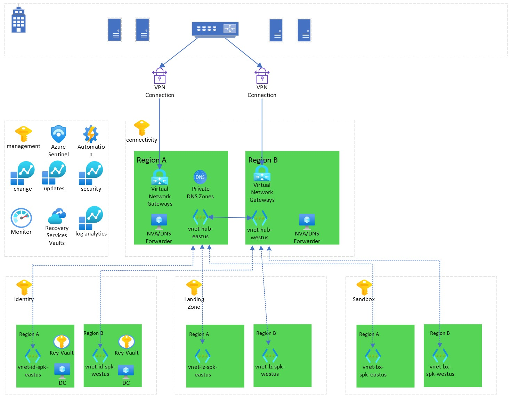

# Multi Region Landing Zone for Demos/POC
Terraform Landing Zones leveraged to build out a Hybrid Multi Region Environment with private endpoints

## Overview

Provide a repository to quickly build out demo/poc environments to test different use cases.  Solution is broken into Landing Zones to allow individual components to be modified without affecting the entire solution and to provide the option of deploying.  Two Core sections exist within the solution.  Landing Zones and AppZones.  Landing Zones will provide the core infrastructure which will be needed to deploy applications which will be housed within the AppZones.  Both will provide the option for Multi-Region or Single Region deployment.  Currently only the Multi-Region Hub Spoke option is provided.  All components listed in the below diagram are deployed as a result of Level 2-4.  

## Landing Zones

Assumptions: on-prem or simulated on-prem azure environment exists with a domain controller and VPN appliance or Azure Virtual Network Gateway.

### Landing Zone 1

Landing Zone 1 will house Enterprise Scale Policies if you choose to deploy.  Policies will be added overtime to match the Policies provided through Eterprise Scale Landing Zones.  Policies will be implemented with terraform therefore, removing a policy will only require commenting the policy out.

### Landing Zone 2

Landing Zone 2 deploys a hub in each region defined as well as the identity spokes and all the required components to finalize dual VPN connections to on-prem.  In addition to the networking components all shared services will be created in the management subscription.

### Landing Zone 3

Landing Zone 3 deploys a jumphost/developer machine, domain controller in each region, and a dns server in each region.  Each of the virtual machines will be configured through Desired State Configuration which is applied through the automation account.

### Landing Zone 4
Landing Zone 4 builds out the spokes for landingzone and sandbox subscriptions.  Private Dnz zones are linked to each vnet to allow private endpoints to be leveraged.

## Steps to Deploy Landing Zones
Modify variable files for each of the Landingzones you will be implementing.  For Level 2 the first 83 lines of variables are the ones you which need to be evaluated for your environment.  The remainder of the variables after that can remain the same or you may change to your preference.  Level 3 the first 48 lines of variables need to be updated. Level 4 the first 37 lines of variables need to be updated.

Once all variable files have been updated in your terminal change directory to the Level 2 subfolder.  Run Terraform init to build the terraform dependancies.  Once complete run Terraform apply.  Terraform will present all the changes it will be making. Once you have verified type yes to move forward. 

Upon completion of Level 2, find the private ip addresses of the two VPN Gateways created from the deployment.  Go to your onprem/or simulated onprem and update the peer ip on your vpn connections for the corresponding regions.  Note there  are two vpn connections created one for each of the regions.  Once complete open a the PowerShell script provided in the PowerShell directory. Update the automation account name to the one you provided in the variable file earlier.  The part which should need to be changed is the prefix you supplied.  Once updated run the PowerShell script.  This script will compile the DSC configurations which were uploaded to the azure automation account in Level 2.  Once the script has complete varify both vpn connections are connected.

Level 3 can now be run by changing directory in your terminal window Level 3 and running terraform init followed by terraform apply.  Once complete five virtual machines will be deployed to azure.  Two domain controllers one in each region which will be added to the on-prem domain.  Two DNS servers which will be domain joined and act as condition DNS forwarders.  And finally a developer/jumphost virtual machine which is domain joined and has developer tools installed.

Level 4 completes the landing zones by again switching to Level 4 directory and running terraform init followed by terraform apply. Once complete the infrastructure for your demo/lab environment is now built.  All passwords provided are stored into the private keyvaults which were deployed for future reference.

## OnPrem Configuration
For the hybrid scenario you will either be leveraging an onprem vpn device or an azure simulated onprem environment.  In either case you will need to configure the vpns on this side manually.  There will be one for each region.  When you create your local network gateways for each region you will need to provide all the address spaces for all corresponding vnets in the region you are configuring.
Therefore, for region A it will be the following 10.1.0.0/16, 10.3.0.0/16, 10.5.0.0/16, and 10.7.0.0/16.  For region B it will be the following 10.2.0.0/16, 10.4.0.0/16, 10.6.0.0/16 and 10.8.0.0/16.

## Tearing down the environment
As needed the environment can be easily destroyed.  If you are leaving your on-prem environment up the first thing you will want to do is go to azure automation account.  On the left click State Configuration(DSC). Select each domain conntroller on the right one at a time. After selecting click unregister.  This will prevent DSC from reappling the configuration.  Once complete login to each of the domain controllers created in Landing Zone 3.  After logging on remove the Active Directory Domain Services role.  Selecting it will throw validation results stating you need to demote the domain controller.  Click on the demote this domain controller and continue through the prompts.  This will need to be completed on each domain controller.  Once complete I recommend validating they were successfully removed by looking at Active Directory Users and Computers on the on-prem machine.  You may not leverage terraform to destroy each of the individual zones.  From the terminal window change directory to the Level 4 and run terraform destroy.  Terraform will walk through and remove all the components deployed.  Once complete change directory to the next zone and repeat until you have destroyed all zones.  At this point you are ready to redeploy then next time you need to test/validate.

